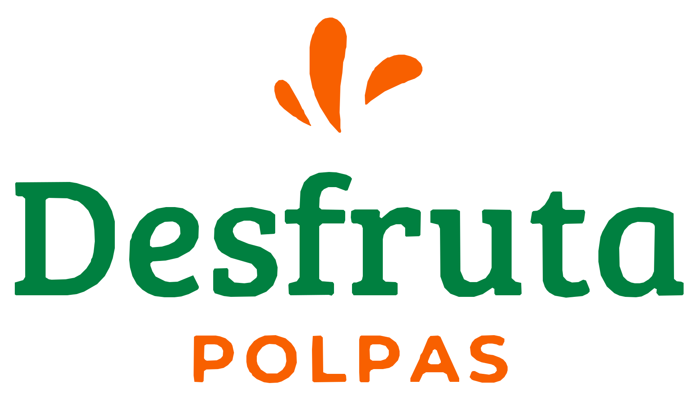

<div align="center">
  
  <h1>Desfruta Stock</h1>
  <p>Painel de gestão de estoque, produtos, vendas e operação, com frontend moderno em React e backend em Flask.</p>

  <p>
    
    
    
    
    
    
    
    
  </p>
</div>

---

## Visão geral

O **Desfruta Stock** é uma base de sistema de gestão com foco em operação comercial e controle de estoque. O projeto já está estruturado com:

- dashboard principal com métricas operacionais
- sidebar fixa e minimizável
- avatar com iniciais dinâmicas do usuário autenticado
- telas-base para cada aba do sistema
- autenticação com JWT
- backend preparado para integração com banco SQLite
- estrutura pronta para evolução das APIs e indicadores

## Stack utilizada

### Frontend
- **React** para construção da interface
- **Vite** para ambiente de desenvolvimento rápido
- **Axios** para comunicação com API
- **CSS** customizado para identidade visual da aplicação
- **Lucide React** para ícones da interface

### Backend
- **Flask** como framework principal da API
- **Flask-CORS** para permitir integração com frontend
- **Flask-JWT-Extended** para autenticação via token
- **SQLite** como banco local
- **python-dotenv** para variáveis de ambiente

## Estrutura do projeto

```bash
.
├── frontend/
│   └── src/
│       ├── api/
│       ├── assets/
│       ├── components/
│       ├── App.jsx
│       ├── global.css
│       └── main.jsx
└── backend/
    └── backend/
        ├── core/
        ├── data/
        ├── app.py
        └── requirements.txt
```

## Funcionalidades implementadas

- Login com retorno de token e dados do usuário
- Endpoint autenticado para buscar perfil com `/api/me`
- Dashboard com foco em:
  - **Total de Produtos em Kg**
  - **Variações disponíveis**
  - **Faturamento mensal**
- Tabela de **atividade recente**
- Estrutura visual pronta para:
  - Gerenciar Produtos
  - Dashboard
  - Gerenciar Estoque
  - Funcionários
- Sidebar ajustada para uso real em ambiente administrativo

## Endpoints já disponíveis

### Autenticação
- `POST /api/login`
- `POST /api/register`
- `GET /api/me`

### Operação
- `POST /api/register-venda`
- `GET /api/relatorio-vendas`
- `GET /api/ping`

## Como executar o backend

Entre na pasta do backend e instale as dependências:

```bash
cd backend/backend
pip install -r requirements.txt
python app.py
```

## Como executar o frontend

Na aplicação frontend, instale as dependências do projeto e rode o servidor de desenvolvimento:

```bash
cd frontend
npm install
npm run dev
```

## Variáveis de ambiente

Crie um arquivo `.env` no backend com a chave JWT:

```env
JWT_SECRET_KEY=sua_chave_super_secreta
```

## Padrão visual do projeto

Este repositório foi estruturado com uma proposta visual inspirada em dashboards profissionais:

- navegação lateral fixa
- leitura rápida de métricas
- identidade limpa e corporativa
- áreas prontas para evolução com dados reais da API
- separação clara entre base visual e integração backend

## Melhorias recomendadas

- separar as páginas em componentes e rotas dedicadas
- criar camada de services para consumo das APIs
- adicionar controle de permissões por cargo
- implementar gráficos reais com dados do banco
- criar testes no frontend e backend
- padronizar validações e tratamento de erros da API

## Observação

Este projeto já está pronto como **base profissional de dashboard**, mas ainda pode evoluir para uma arquitetura mais robusta com:

- React Router
- Context API ou Zustand
- componentização completa
- paginação e filtros reais
- deploy do frontend e backend

---

<div align="center">
  <strong>Desenvolvido como base administrativa para o ecossistema Desfruta.</strong>
</div>
